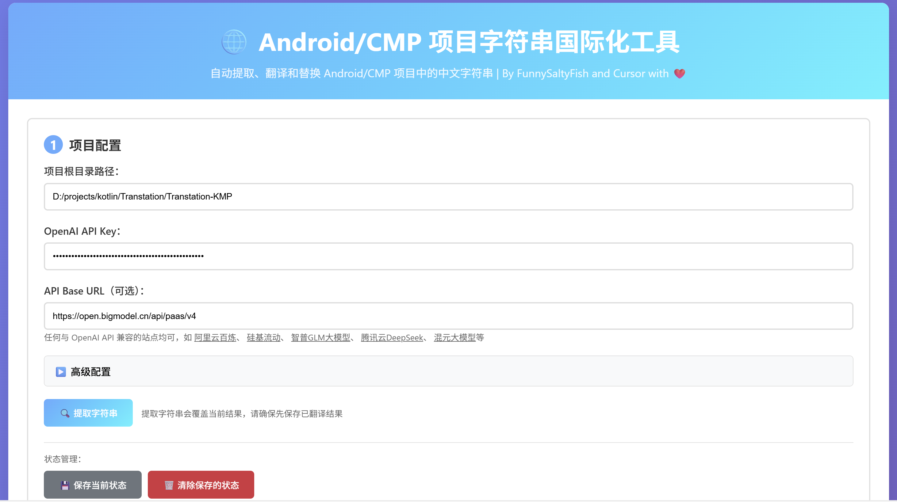
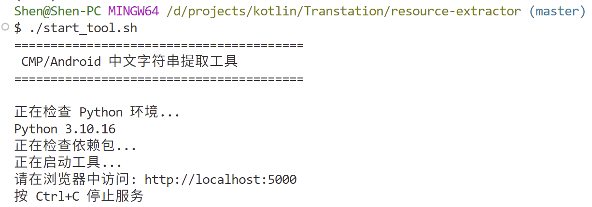
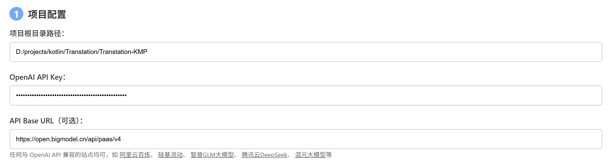
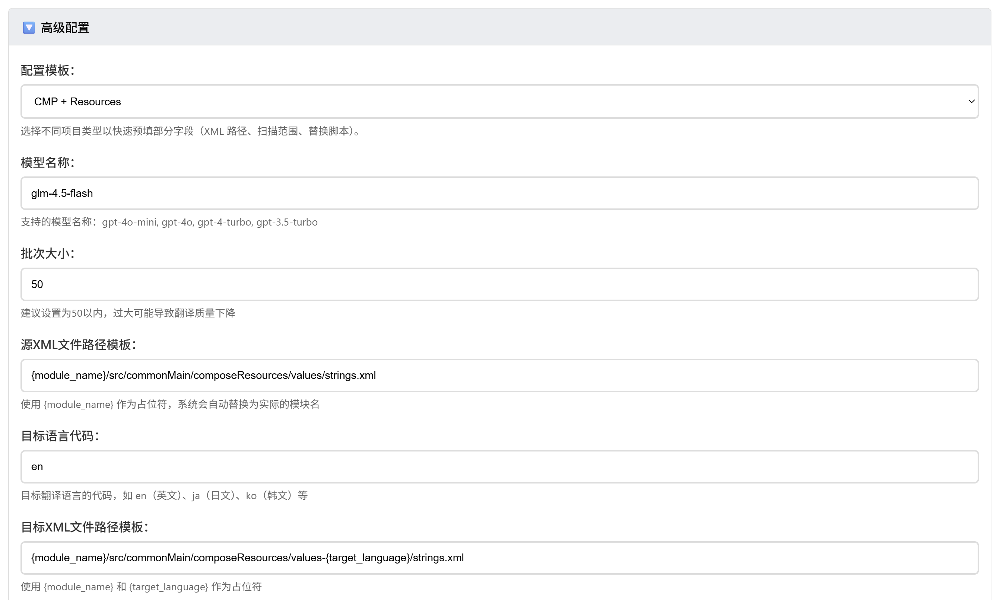
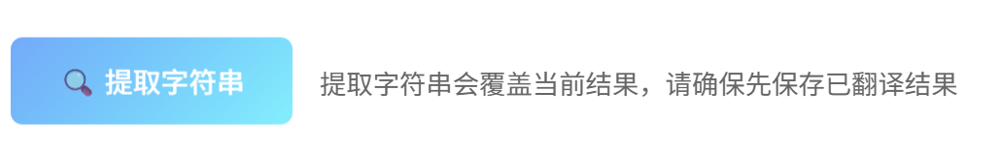
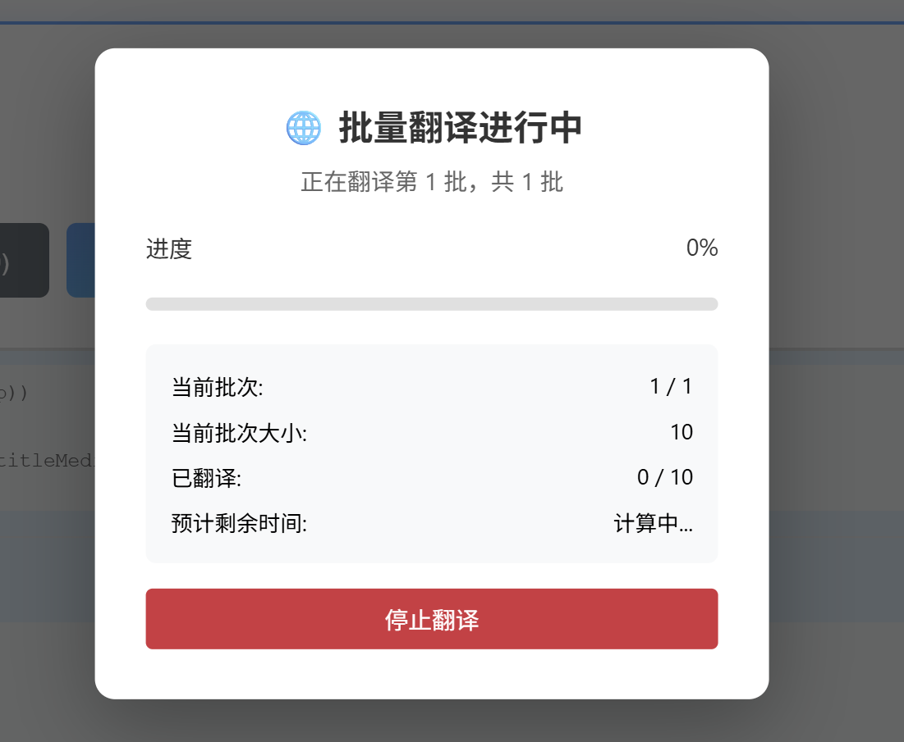
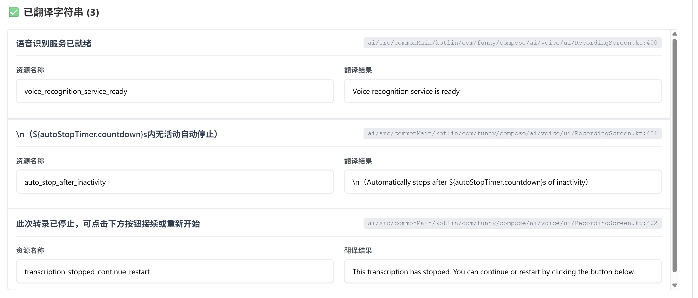
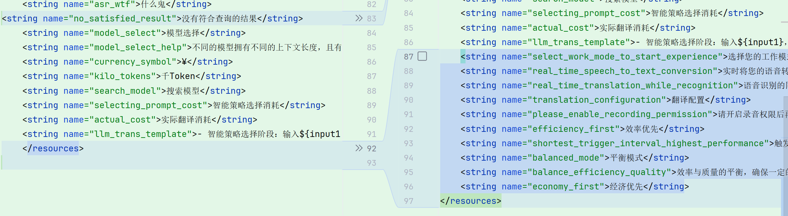
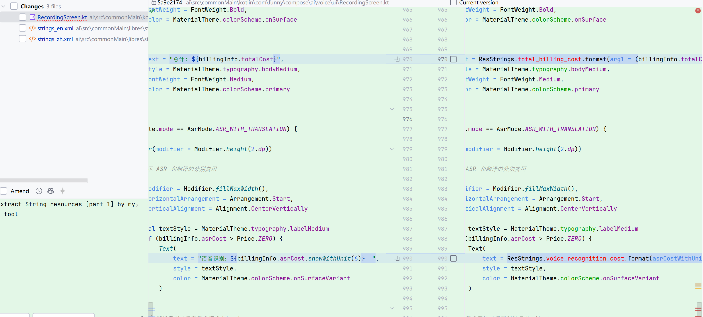

# 🌐 Android/CMP 项目字符串国际化工具

一键提取、翻译、替换项目中的中文字符串，支持 Android、Kotlin Multiplatform (KMP + LibRes)、Compose Multiplatform (CMP + Resources) 等多种项目类型。



## ✨ 特性

- 🔍 **智能提取**：自动扫描项目中的中文字符串
- 🤖 **AI翻译**：支持 GPT-4o、Claude 等多种模型
- 📦 **多框架支持**：KMP + LibRes、CMP + Resources、纯 Android 等等
- 🎯 **批量处理**：可配置批次大小，提高效率
- 💾 **状态保存**：自动保存进度，可接续操作
- 🎨 **现代界面**：直观的 Web 界面，响应式设计

## 🚀 快速开始

### 1. 安装依赖

> 需要 Python >= 3.9

```bash
pip install -r requirements.txt
```

### 2. 启动工具

> 脚本中和下面命令中的 `python` 均为 Python 3

```bash
# Windows
start_tool.bat

# Linux/Mac
./start_tool.sh

# 或直接运行
python chinese_string_extractor.py
```

然后浏览器打开 http://localhost:5000



### 3. 配置项目

#### 基础配置



- **项目路径**：选择项目根目录
- **API Key**：输入 OpenAI API Key
- **API Base URL**：可选，任何与 OpenAI API 兼容的站点均可，如
    - <a href="https://www.aliyun.com/minisite/goods?userCode=sbzp0ocq" target="_blank">阿里云百炼</a>
    - <a href="https://cloud.siliconflow.cn/i/bVKKwZQO" target="_blank">硅基流动</a>
    - <a href="https://www.bigmodel.cn/invite?icode=J%2FLj03nGizGSqTve3KYWamczbXFgPRGIalpycrEwJ28%3D" target="_blank">智普GLM大模型</a>
    - <a href="https://curl.qcloud.com/oaWSvb9o">腾讯云DeepSeek</a>
    - <a href="https://curl.qcloud.com/otBhKPFa">混元大模型</a>
    - 等等


#### 高级配置模板
选择项目类型，自动填充配置：

| 模板 | 适用场景 | XML路径 | 替换脚本 |
|------|----------|---------|----------|
| **KMP + LibRes** | Kotlin Multiplatform | `strings_zh.xml` | ResStrings.xx |
| **CMP + Resources** | Compose Multiplatform | `values/strings.xml` | stringResource() |
| **纯 Android** | Android 原生项目 | `res/values/strings.xml` | getString() |

剩余高级配置请仔细填写，确认每一项均符合要求



##### 格式化脚本

比较困难的一点是“格式化脚本”，可在模板基础上修改，此处语言为Python。你需要实现三个函数：

- `format_xml_text`：格式化 XML 文本（保存到 xml 中的条目如何格式化），参数为文本和参数列表。参数列表形如 `[{"name": "countDownSeconds", "value": "countDownMs / 1000"}]`
- `get_replaced_text`：获取替换文本（保存到代码中的条目如何格式化），参数为资源名称、参数列表以及文件绝对路径
- `get_import_statements`：获取导入语句（保存到代码中的条目如何导入），参数为模块名称以及文件绝对路径

可点击“查看脚本实例“查看示例，并参考结构进行更改。也可以借助 AI 帮助。

##### 翻译批次

指定了每一批一起翻译多少字符串，此值请参考你选择模型的“上下文窗口”大小，以及你的字符串平均长度。不建议太大，会导致结果变差、等待时间过长、以及可能被截断。

##### 翻译提示词

指定了提示词，请一定按需修改。顺带注意，**使用单个大括号（`{}`）** 包裹的为内置变量，请确保全部保留；如果需要使用到大括号自身，请使用 `{{}}` 转义

### 4. 提取字符串

点击 **🔍 提取字符串** 开始扫描项目。如果先前已有已翻译但是未最终保存的条目，**会覆盖**，请注意及时保存翻译结果



### 5. 选择和翻译

#### 选择操作
- **点击选择**：单击条目切换选择状态
- **批量选择**：全选/取消全选按钮
- **拖拽选择**：按住拖拽选择（或反选）连续区域
- **忽略功能**：选中一部分后可忽略这些字符串

#### 开始翻译
1. 选择完翻译的字符串
2. 点击 **🌐 翻译选中项**
3. 实时查看翻译进度



### 6. 编辑和保存

#### 编辑翻译结果
- **资源名称**：调整生成的资源 ID
- **翻译结果**：修改 AI 翻译内容



#### 保存更改
> 保存更改前建议备份源代码，避免错误修改

点击 **💾 保存更改** 执行：
- 生成 XML 资源文件
- 替换代码中的字符串
- 自动添加必要的 import





> 标红是因为没 build，build 完就好了

## 🛠️ 故障排除

### 常见问题

**Q: 翻译失败怎么办？**
A: 检查 API Key、网络连接，尝试减少批次大小

**Q: 某些字符串不想翻译？**
A: 使用忽略功能，被忽略的字符串不会再次出现

**Q: 翻译结果不理想？**
A: 调整翻译提示词，或添加参考翻译提高一致性

**Q: 程序运行出错？**
A: 查看控制台错误信息，确保依赖库已正确安装

### 最佳实践

1. **使用前备份**：`git commit` 保存当前状态
2. **分批翻译**：大项目建议分模块处理
3. **人工校对**：AI 翻译结果建议人工审核
4. **测试验证**：翻译后测试应用功能是否正常

## 📂 项目结构

```
android-kmp-cmp-string-extractor/
├── chinese_string_extractor.py    # 主程序
├── helper.py                      # 核心逻辑
├── static/
│   └── index.html               # Web 界面
├── start_tool.bat               # Windows 启动脚本
├── start_tool.sh                # Linux/Mac 启动脚本
├── requirements.txt             # 依赖列表
└── README.md                    # 使用说明
```

## 🤝 贡献

欢迎提交 Issue 和 Pull Request！

**开发环境：**
```bash
git clone <repository>
cd android-kmp-cmp-string-extractor
pip install -r requirements.txt 
python chinese_string_extractor.py # 需要 Python 3.9.0 以上
```

## 📄 开源协议
Apache 2.0

---

**💖 支持作者**

觉得好用？感觉有帮助？  
[**支持作者以继续开发**](https://web.funnysaltyfish.fun/?source=string_extractor)

---

⚠️ **注意事项**
- 首次使用前请备份代码
- 翻译结果需要人工审核
- 注意 API 使用费用
- 保护好 API Key 安全
